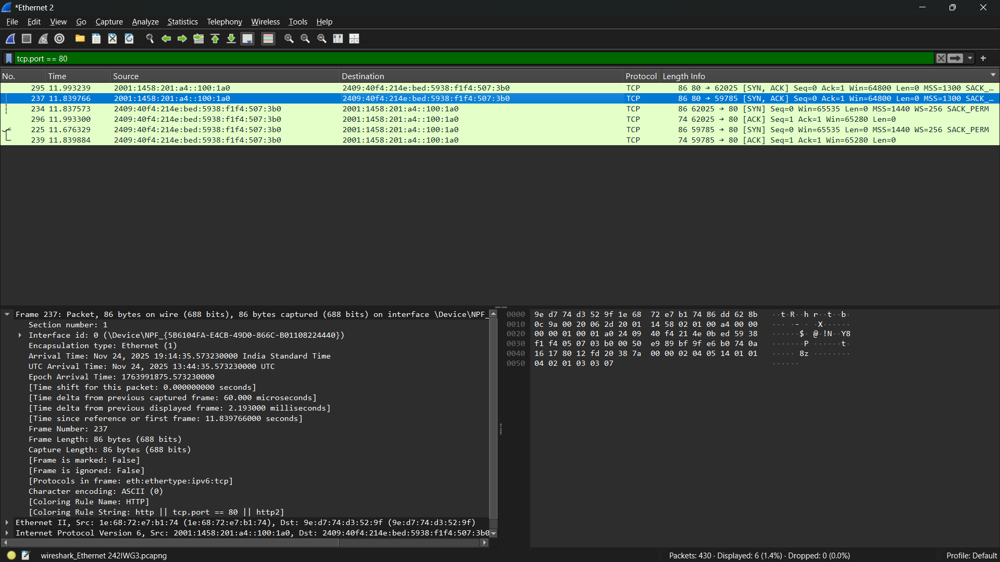

# 📡 Network Traffic Analysis: TCP Handshake Investigation

### 🔍 Project Objective
To analyze network traffic at the packet level using **Wireshark**, identifying the TCP 3-Way Handshake mechanism and validating successful connection establishment. This project simulates a Level 1 SOC Analyst task of verifying network connectivity and detecting potential anomalies.

### 🛠️ Tools Used
* **Wireshark:** Packet capture and analysis.
* **TCP Protocol:** Connection-oriented communication verification.
* **Filters:** `tcp.port == 80` (Traffic isolation).

### 📊 Key Findings (The 3-Way Handshake)
I successfully captured and identified the standard TCP connection sequence:
1.  **[SYN]:** Client initiated connection request.
2.  **[SYN, ACK]:** Server acknowledged and replied.
3.  **[ACK]:** Client confirmed, establishing the session.

### 🛡️ Security Context (Why this matters)
Understanding this normal baseline is critical for detecting **SYN Flood Attacks** (DoS), where an attacker sends massive `SYN` packets but never completes the `ACK`, exhausting server resources.

### 📸 Evidence

*(Note: Full PCAP file included in repository for review)*