  

> **CLASSIFIED OPERATION:** DEEP PACKET INSPECTION & NETWORK FORENSICS  
> **STATUS:** CONCLUDED | **AUTHOR:** MR. CIPHER-X [C|THE]

 

### 🛡️ Operation Abstract

This repository details a tactical Network Traffic Analysis operation. Leveraging deep packet inspection (DPI) on raw `.pcap` files, the objective was to dissect network protocols, identify data exfiltration attempts (such as DNS tunneling), reconstruct malicious TCP streams, and extract cleartext credentials broadcasted over insecure channels.

---

### ⚙️ Network Inspection Architecture (DPI Flow)

```mermaid
graph TD;
    A[Raw Packet Capture .pcap] -->|Wireshark / tshark| B(Protocol Dissection);
    B --> C{Traffic Layer Analysis};
    C -->|HTTP / FTP / Telnet| D[Cleartext Protocol Inspection];
    C -->|DNS / ICMP| E[Covert Channel Detection];
    C -->|HTTPS / TLS| F[Encrypted Handshake Analysis];
    D -->|Follow TCP Stream| G[Extract Stolen Credentials];
    E -->|High Query Volume/Anomalous Payloads| H[Identify DNS Tunneling / DGA];
    F -->|JA3 Hash Mismatch / Invalid Cert| I[Detect Rogue C2 Beacon];
    G --> J[Compile Network IOCs & Signatures];
    H --> J;
    I --> J;
    
    style A fill:#1a1a1a,stroke:#00FFFF,stroke-width:2px;
    style J fill:#1a1a1a,stroke:#8A2BE2,stroke-width:2px;
```

---

### 🦠 Threat & Mitigation Matrix

| **Threat Vector** | **Indicators of Compromise (IOCs)** | **Detection Technique** | **Tactical Mitigation / Response** |
| :--- | :--- | :--- | :--- |
| **Cleartext Credential Harvesting** | Passwords transmitted via HTTP POST or FTP | TCP Stream Reassembly | Force HTTPS/FTPS, invalidate compromised credentials. |
| **DNS Tunneling (Exfiltration)** | Excessively long TXT records, abnormal query length | DNS Traffic Baseline Comparison | Implement DNS sinkhole, restrict outbound queries to approved resolvers. |
| **Rogue C2 Beaconing** | Repeated SYN packets to unknown external IPs on anomalous ports | Connection Flow Analysis | Drop traffic at perimeter firewall, update IDS/IPS signatures. |

---

### 📸 Digital Evidence Board

*(Note: Target network topologies and raw IP addresses are classified. The following evidence represents reconstructed streams and protocol filters.)*

  <!-- NOTE: REPLACE THESE SRC LINKS WITH YOUR ACTUAL GITHUB IMAGE PATHS -->
  
  &nbsp; &nbsp;
  

---

  <code>[ OPERATION TERMINATED - NETWORK SECURED ]</code>

